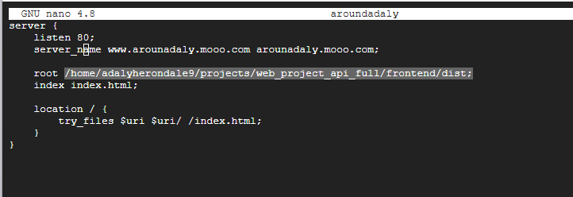

# Proyecto Around the U.S. 
SPRINT 18 
## Descripción
Este proyecto es una aplicación web completa que permite a los usuarios registrarse, iniciar sesión, editar su perfil, agregar y eliminar tarjetas, y dar/quitar "me gusta" a las tarjetas. El proyecto está compuesto por un frontend en React y un backend en Express.js.

## Tecnologías utilizadas
- **Frontend**: React, React Router, CSS, Js
- **Backend**: Node.js, Express.js, MongoDB, Mongoose
- **Autenticación**: JWT, bcryptjs
- **Validación**: celebrate, Joi
- **Registro**: Winston, express-winston
- **Seguridad**: CORS, HTTPS

## Estructura del proyecto
El proyecto está organizado en dos directorios principales:
- `frontend/`: Contiene la aplicación React
- `backend/`: Contiene la API REST en Express.js

## Configuración del servidor

### Requisitos previos
- Node.js (v14 o superior)
- MongoDB
- PM2 (para gestión de procesos)
- Nginx (para servir el frontend y proxy al backend)
- Certbot (para certificados SSL)

### Pasos para el despliegue

1. **Clonar el repositorio**
```
git clone https://github.com/luxenherondale/web_project_api_full.git
cd web_project_api_full
```

2. **Configurar el backend**
```
cd backend
npm install
```

3. **Configurar el frontend**
```
cd ../frontend
npm install
npm run build
```

4. **Crear archivo .env en el servidor**
En el directorio backend, crea un archivo .env con las siguientes variables:
```
NODE_ENV=production
JWT_SECRET=tu_clave_secreta_aquí
```

5. **Configurar Nginx**
Creación de un archivo de configuración en `/etc/nginx/sites-available/` y creación de un enlace simbólico en `/etc/nginx/sites-enabled/`.



6. **Configurar certificados SSL con Certbot**
```
sudo certbot --nginx -d tudominio.com -d www.tudominio.com
```

7. **Iniciar la aplicación con PM2**
```
cd backend
pm2 start app.js --name "around-backend"
pm2 save
pm2 startup
```

## Endpoints de la API

### Públicos
- `POST /signup`: Registro de usuario
- `POST /signin`: Inicio de sesión

### Protegidos (requieren token JWT)
- `GET /users`: Obtener todos los usuarios
- `GET /users/me`: Obtener información del usuario actual
- `GET /users/:id`: Obtener un usuario específico
- `PATCH /users/me`: Actualizar perfil
- `PATCH /users/me/avatar`: Actualizar avatar
- `GET /cards`: Obtener todas las tarjetas
- `POST /cards`: Crear una nueva tarjeta
- `DELETE /cards/:cardId`: Eliminar una tarjeta
- `PUT /cards/:cardId/likes`: Dar like a una tarjeta
- `DELETE /cards/:cardId/likes`: Quitar like de una tarjeta

## Acceso al servidor
- **Dominio**: https://www.arounadaly.mooo.com
- **Frontend**: https://www.arounadaly.mooo.com
- **API**: https://api.arounadaly.mooo.com

## Autor
Adaly Arcia
